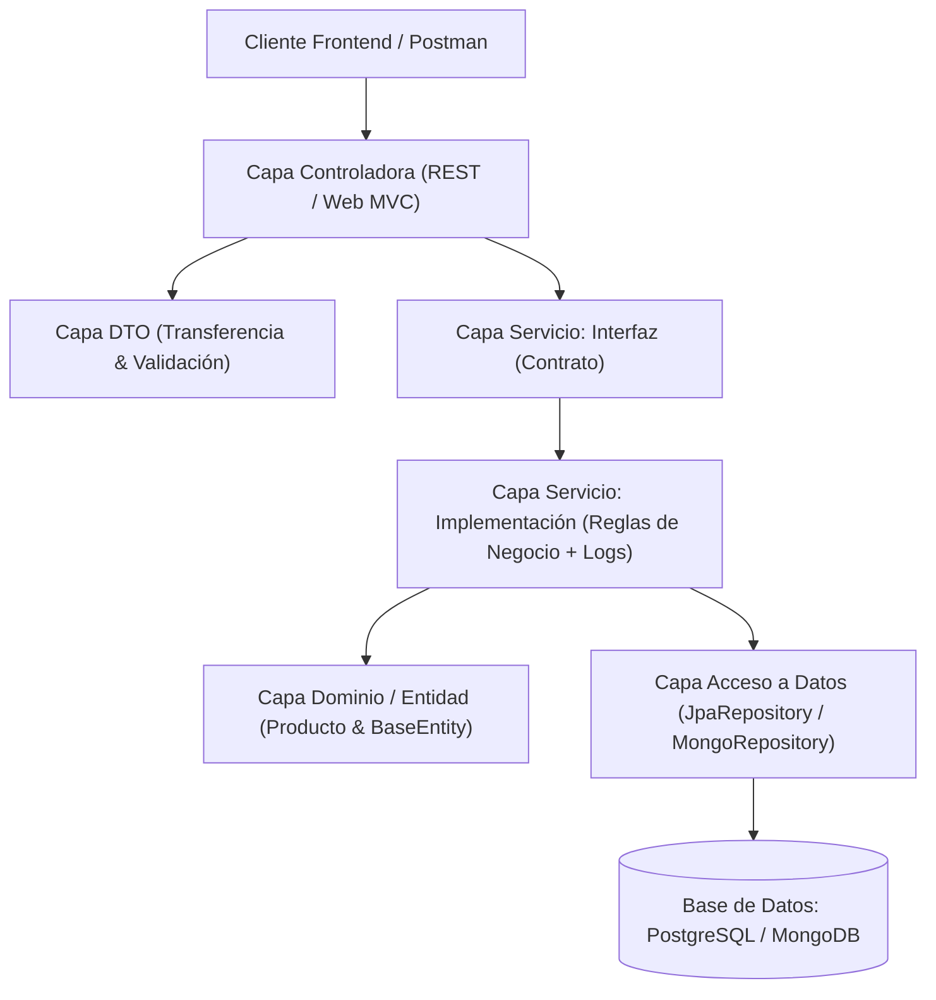
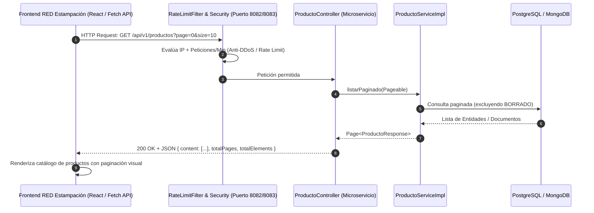

# 📦 Proyecto 2 & 3: Microservicio CRUD de Productos (JPA/PostgreSQL & MongoDB)

Microservicio desarrollado con **Spring Boot 4 / Java 21** aplicando **Arquitectura Orientada al Dominio (ODD / DDD)**, programación por capas, contratos mediante interfaces, herencia con auditoría, validaciones robustas con Jakarta Validation, manejo centralizado de excepciones con códigos de estado HTTP semánticos, sistema de logs estructurados, seguridad con Spring Security, control de tasa de peticiones (**Rate Limiting**), prevención de exploits/inyecciones, vistas web interactivas con **Thymeleaf + Bootstrap 5**, y soporte para bases de datos relacionales (PostgreSQL/JPA) y NoSQL (MongoDB).

---

## 🏛️ Explicación de la Arquitectura Orientada al Dominio (ODD / DDD)

La **Arquitectura Orientada al Dominio** (ODD - *Oriented Domain Design* / DDD) sitúa al modelo de negocio en el núcleo del sistema, desacoplando las reglas de la infraestructura técnica. En este microservicio, la solución se organiza en 5 capas claramente diferenciadas:



### 1. Capa de Dominio / Entidades (`com.example.servicio.entity`)
- **Entidades Ricas**: La entidad `Producto` no es un simple contenedor de datos (modelo anémico), sino que contiene reglas de validación propias de negocio como `esPrecioCopValido()` (verificación de múltiplos de 50 COP) y `puedePublicarse()`.
- **Herencia y Reutilización (`BaseEntity`)**: Se define una clase abstracta base que maneja la auditoría del ciclo de vida (`createdAt`, `updatedAt`) de forma automática, reduciendo la redundancia de código y garantizando consistencia.

### 2. Capa de Acceso a Datos / Repositorios (`com.example.servicio.repository`)
- **Desacoplamiento**: Se implementan interfaces que extienden `JpaRepository` (en PostgreSQL) o `MongoRepository` (en MongoDB).
- **Consultas Declarativas y Avanzadas**: Métodos derivados de Spring Data para búsquedas compuestas (`AND`) y consultas personalizadas mediante `@Query` (JPQL y JSON MongoDB) para búsquedas de texto múltiple (`OR`).

### 3. Capa de Servicios / Lógica de Negocio (`com.example.servicio.service`)
- **Programación Orientada a Interfaces**: Definición estricta del contrato en `ProductoService` e implementación en `ProductoServiceImpl`. Esto permite cambiar el mecanismo de almacenamiento o simular mocks en pruebas unitarias sin alterar los controladores.
- **Trazabilidad de Logs**: Integración de **SLF4J** en cada flujo crítico (`INFO` para transacciones exitosas, `WARN` para validaciones o duplicados, y `ERROR` para excepciones).

### 4. Capa de Transferencia de Datos / DTOs (`com.example.servicio.dto`)
- **Aislamiento del Modelo Interno**: Se utilizan DTOs (`ProductoRequest`, `ProductoResponse`, `ProductoPageResponse`) para no exponer directamente las entidades a la red, previniendo sobreescrituras accidentales y optimizando el serializado JSON.

### 5. Capa de Controladores y Excepciones (`com.example.servicio.controller` / `com.example.servicio.exception`)
- **Controladores Híbridos**: API RESTful (`ProductoController`) para clientes SPA o microservicios externos, y Controlador MVC (`ProductoViewController`) para la gestión visual en Thymeleaf.
- **Manejo Centralizado de Excepciones**: Con `@RestControllerAdvice` (`GlobalExceptionHandler`), ningún fallo expone volcados de memoria (StackTraces); en su lugar, se retornan respuestas JSON estandarizadas con códigos HTTP semánticos.

---

## 🔗 Comunicación entre `Proyecto2_JPA` y `projecto_formativo`

Este microservicio se integra con el proyecto formativo principal (**RED Estampación**) simulando una **Arquitectura de Microservicios Desacoplada**:



### ¿Cómo se comunican los proyectos?
1. **Consumo mediante Fetch / Axios**: El Frontend de `projecto_formativo` realiza peticiones asíncronas vía HTTP a los endpoints del microservicio (`http://localhost:8082/api/v1/productos` en PostgreSQL o `http://localhost:8083/api/v1/productos` en MongoDB).
2. **CORS Habilitado (`CorsConfig.java`)**: Se configuró la política de intercambio de recursos de origen cruzado para admitir los orígenes del frontend (`http://localhost:3000`, `http://localhost:5173`, etc.), permitiendo métodos `GET`, `POST`, `PUT`, `DELETE` y cabeceras de autorización.
3. **Estrategia de Ramas Git Espejo**:
   - Para evaluar la integración con base de datos relacional: `Proyecto2_JPA` en rama `main` interactúa con la rama `java/microservicio` de `projecto_formativo`.
   - Para evaluar la integración NoSQL: `Proyecto2_JPA` en rama `java/mongoDB` interactúa con la rama `java/mongoDB` de `projecto_formativo`.

---

## 🌳 Estructura de Ramas y Conexión

| Rama en `Proyecto2_JPA` | Motor de Base de Datos | Tecnología ORM / ODM | Puerto | Conexión con `projecto_formativo` |
| :--- | :--- | :--- | :--- | :--- |
| `main` | **PostgreSQL** | Spring Data JPA / Hibernate | `8082` | Rama `java/microservicio` |
| `java/mongoDB` | **MongoDB** | Spring Data MongoDB | `8083` | Rama `java/mongoDB` |

---

## 🚀 Requisitos y Características Implementadas

### 1. 🔍 Búsquedas Avanzadas (AND / OR)
- **Búsqueda por 2 campos con operador AND**:
  - *JPA/PostgreSQL*: `findByNombreContainingIgnoreCaseAndEstado`
  - *MongoDB*: `findByNombreRegexAndEstado` (expresión regular case-insensitive + estado)
- **Búsqueda por 3 campos con operador OR**:
  - *JPA/PostgreSQL*: Consulta JPQL sobre `nombre`, `descripcion` y `referencia`, filtrando registros no borrados.
  - *MongoDB*: Consulta `@Query` con operadores `$or` y `$regex` sobre `nombre`, `descripcion` y `referencia`.

### 2. 🛡️ Validaciones con Anotaciones en la Entidad (5 Validaciones)
1. `@NotBlank(message = "El nombre del producto es obligatorio")`: Control de campos no vacíos.
2. `@Size(min = 3, max = 100)`: Restricción de longitud del nombre (y `@Size(max = 500)` en descripción).
3. `@Pattern(regexp = "^[^\\p{Cntrl}]*$")`: Sanitización contra caracteres de control e inyecciones.
4. `@NotNull` + `@DecimalMin(value = "50.0")`: Validación de precio base mínimo en COP (múltiplo de 50).
5. `@Pattern(regexp = "^[A-Z0-9\\-]{3,20}$")`: Formato alfanumérico estricto para la referencia única del producto.

### 3. 🚨 Manejo Centralizado de Excepciones y Códigos HTTP
Implementado con `GlobalExceptionHandler` (`@RestControllerAdvice`), retornando payloads JSON consistentes con códigos de estado HTTP precisos:
- `200 OK`: Operaciones de lectura y actualización exitosas.
- `201 CREATED`: Creación exitosa de producto.
- `204 NO CONTENT`: Eliminación lógica completada.
- `400 BAD REQUEST`: Errores de validación de datos (`MethodArgumentNotValidException`) o reglas de negocio violadas (`BusinessRuleException`).
- `404 NOT FOUND`: Recurso no encontrado (`ResourceNotFoundException`).
- `429 TOO MANY REQUESTS`: Límite de peticiones por minuto superado (Rate Limit).
- `500 INTERNAL SERVER ERROR`: Errores no controlados del servidor.

### 4. 📜 Sistema de Logs Estructurados
Uso de **SLF4J / Logback** registrando eventos en consola y en archivo rotativo (`logs/`):
- `INFO`: Creación, actualización, búsquedas y cambios de estado.
- `WARN`: Intentos de nombres/referencias duplicadas, fallos de validación y bloqueos por Rate Limit.
- `ERROR`: Excepciones no controladas y recursos no localizados en base de datos.

### 5. 📄 Paginación con JPA / MongoDB y Vistas Web
- Paginación dinámica y configurable (`page`, `size`, `sortBy`, `sortDir`).
- Interfaz web interactiva en `/productos` con **Bootstrap 5**, navegación entre páginas (Anterior / Siguiente / Números) y barra de búsqueda en tiempo real.

---

## 🌟 Milla Extra (Seguridad, Anti-Exploits y Rate Limiting)

- **Control de Tasa de Peticiones (Rate Limiting)**: `RateLimitFilter` y `RateLimitService` monitorean peticiones por IP y método HTTP (GET: 120/min, POST/PUT: 30/min, DELETE: 20/min), bloqueando abusos y ataques de fuerza bruta/DDoS con código HTTP `429 Too Many Requests`.
- **Configuración CORS**: `CorsConfig` habilita el consumo seguro desde el frontend del proyecto formativo.
- **Protección contra Inyección y Exploits**: Parámetros tipados en JPQL/Mongo Queries, DTOs validados con anotaciones Jakarta y límites de tamaño de cabeceras/parámetros en el servidor Tomcat.

---

## 🛠️ Instalación y Ejecución

### Prerrequisitos
- Java 21 LTS instalado
- PostgreSQL (puerto 5432) o MongoDB (puerto 27017) según la rama elegida

### Ejecución en PostgreSQL (Rama `main`)
```bash
git checkout main
cd servicio
./mvnw clean compile
./mvnw spring-boot:run
```

### Ejecución en MongoDB (Rama `java/mongoDB`)
```bash
git checkout java/mongoDB
cd servicio
./mvnw clean compile
./mvnw spring-boot:run
```

---

## 📡 Endpoints de la API REST (`/api/v1/productos`)

| Método | Endpoint | Descripción | Parámetros Query |
| :--- | :--- | :--- | :--- |
| `GET` | `/api/v1/productos` | Listar productos paginados | `page`, `size`, `sortBy`, `sortDir`, `nombre`, `estado`, `search` |
| `GET` | `/api/v1/productos/{id}` | Obtener producto por ID | - |
| `POST` | `/api/v1/productos` | Crear nuevo producto | - (Body JSON) |
| `PUT` | `/api/v1/productos/{id}` | Actualizar producto | - (Body JSON) |
| `DELETE` | `/api/v1/productos/{id}` | Eliminación lógica de producto | - |

### Vistas Web (Thymeleaf)
- **Listado y Búsqueda**: `http://localhost:8082/productos` (o `8083` en MongoDB)
- **Crear Producto**: `http://localhost:8082/productos/nuevo`
- **Editar Producto**: `http://localhost:8082/productos/editar/{id}`

---

## 🎓 Puntos Clave para la Sustentación

1. **¿Por qué Arquitectura Orientada al Dominio (ODD/DDD)?**
   - Garantiza que las reglas del negocio residan dentro del modelo (entidad `Producto`), evitando lógica dispersa y facilitando la migración entre bases de datos (JPA y MongoDB) sin alterar las capas superiores.
2. **¿Cómo se maneja la concurrencia y la seguridad en la API?**
   - A través de `RateLimitFilter`, cada cliente tiene un límite de peticiones por minuto evaluado por IP y método HTTP, respondiendo con `429 Too Many Requests` ante ráfagas de tráfico malicioso.
3. **¿Cómo se logra la eliminación lógica y por qué es una buena práctica?**
   - Los productos eliminados pasan a estado `BORRADO` en vez de borrarse físicamente con `DELETE` de SQL/Mongo. Esto preserva la integridad referencial histórica con pedidos, facturas y auditoría.
